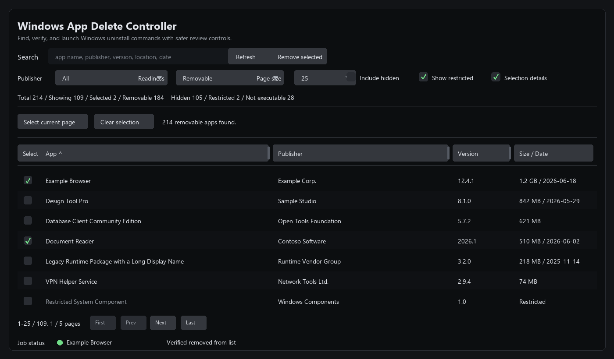

# Windows App Delete Controller

Windows App Delete Controller is a small Windows desktop tool for finding, reviewing, and launching uninstall commands registered in Windows.

It is built with Rust and egui, and reads the standard Windows Uninstall registry entries from HKLM and HKCU.



## Why

Windows can scatter uninstall entries across machine-wide, per-user, 32-bit, and hidden registry locations. Some entries are safe to launch directly, some need administrator permission, and some are marked as restricted by Windows or the publisher.

This app gives you one review surface before launching uninstallers:

- inspect app metadata before removal
- filter noisy or restricted entries
- verify whether a launched uninstaller actually removed the app from the Windows list
- retry elevation-required uninstallers through UAC only when needed

## Features

- Scan installed apps from Windows Uninstall registry keys.
- Search by app name, publisher, version, install location, registry path, size, and install date.
- Filter by publisher, uninstall readiness, hidden system entries, and remove-restricted entries.
- Sort by app name, publisher, version, and estimated size.
- Resize table columns by dragging header boundaries.
- Select apps page by page and launch uninstall commands in sequence.
- Convert MSI install commands such as `MsiExec.exe /I{...}` into uninstall commands using `/X{...}`.
- Detect commands that need elevation and retry them through Windows UAC.
- Re-scan after uninstall commands exit to verify whether the app disappeared from the Windows app list.
- Save UI filters and display settings under `%APPDATA%\WinAppDeleteController\settings.ini`.

## Typical Workflow

1. Search or filter the app list.
2. Review publisher, version, size, install date, and readiness status.
3. Select one or more apps from the current page.
4. Confirm the uninstall commands.
5. Let Windows or the vendor uninstaller complete the removal.
6. Check the job status to see whether the app disappeared from the Windows uninstall list.

## What It Does Not Do

This tool does not force-delete program folders or registry keys directly.

It launches the uninstall command registered by each app, then checks whether the app is still listed in Windows. Some apps may require their own uninstall UI, admin permission, policy changes, or vendor-specific removal tools.

`NoRemove` or remove-restricted entries are shown as restricted because Windows or the app publisher marked them as not normally removable. That does not always mean removal is impossible, but it usually means extra care is needed.

## Run From Source

```powershell
cargo run
```

## Build

```powershell
cargo build --release
```

The executable is created at:

```powershell
.\target\release\win_app_delete_controller.exe
```

## Local Install

Build the release executable first, then run:

```powershell
.\setup\setup.cmd
```

The installer copies the app for the current user and creates shortcuts.

- Install directory: `%LOCALAPPDATA%\Programs\WinAppDeleteController`
- Desktop shortcut
- Start Menu shortcut
- Start Menu uninstall shortcut

You can also run the app without installing:

```powershell
.\setup\run.cmd
```

## Release Package

The repository ignores generated executables and zip files. For GitHub releases, build locally and upload the generated package as a release asset instead of committing it to the repository.

Common local package files:

- `WinAppDeleteControllerSetup.zip`
- `WinAppDeleteControllerSetup-latest.zip`

## Development

Run tests:

```powershell
cargo test
```

Check formatting:

```powershell
cargo fmt -- --check
```

## Notes

- This project targets Windows.
- Administrator permission is requested only when a specific uninstall command requires elevation.
- Uninstall verification is based on whether the app still appears in the Windows Uninstall registry list.
